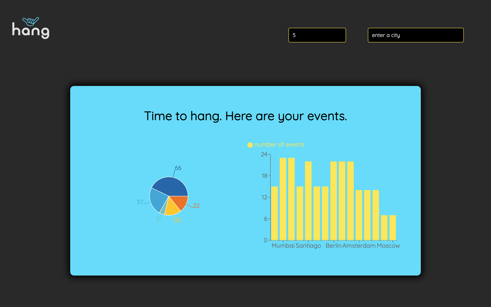
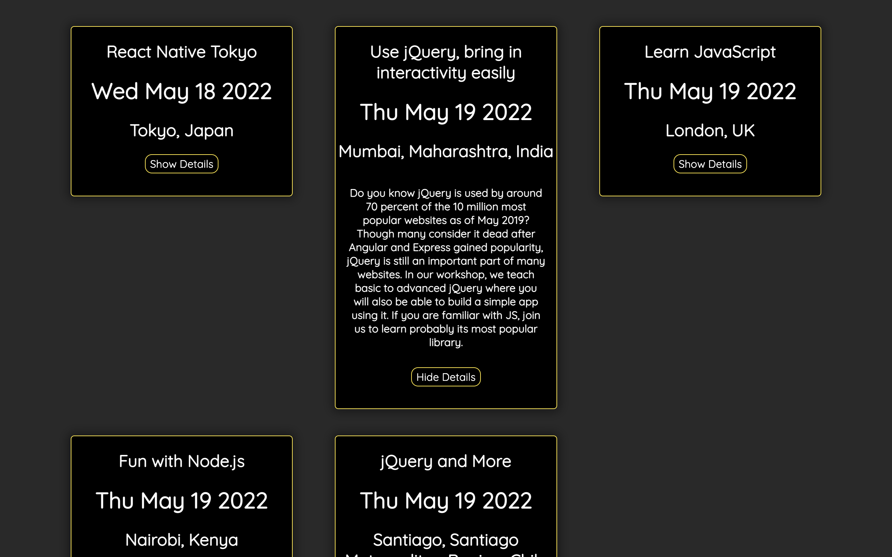

# Meet App

### Last Updated: May 18, 2022


<p left="float">
	
	
</p>

# Overview
Meet is a meetup app that uses React with the Google Calendar API to allow users to view events in their city. Users can search for a specific number of events and filter by city. There is also a barchart and piechart that give users a graphical visualization on the type and number of events in each city.

# Key Features
* A login page that uses Google Authentication for login.
* Data visualization using Reachart piechart and barchart that shows users where the most events are.
* Option to filter events by number and city.
* Is a Progressive Web App so works both online and offline.
* Developed using Test Driven Development with Jest.
* Developed using Behavior Driven Development with Puppeteer.


# Dependencies
* React 17.0.2
* Recharts 2.1.9
* Jest 3.0.1
* Puppeteer 13.5.1

# Getting Started

This project is also available at [https://krishokr.github.io/meet/](https://krishokr.github.io/meet/).

Clone this repository

```git clone https://github.com/krishokr/meet.git```

Go to project's root directory

```cd meet```

Install dependencies

```npm install```

Run the project using npm

```npm start```

